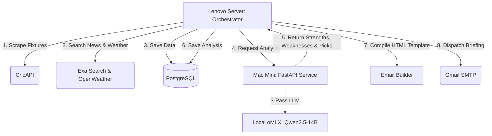

# Match Intelligence — Cricket Analytics & AI Picks Pipeline

Match Intelligence is an automated system that delivers a daily cricket briefing email. It discovers scheduled matches, searches for recent form, injury updates, squad details, and pitch/weather conditions, and then uses a local Large Language Model (LLM) to perform deep analysis, predict the winner ("AI Pick"), and detail each team's strengths and weaknesses.

---

## System Architecture

The project is split across two machines to optimize performance:
1. **Mac Mini (AI Inference Host)**: Runs a local FastAPI service that wraps an `oMLX` server running `Qwen2.5-14B-Instruct-4bit` to perform a 3-pass analysis of matches.
2. **Lenovo Server (Data & Pipeline Orchestrator)**: Runs a PostgreSQL database, scrapes data feeds (CricAPI, Exa news search, OpenWeatherMap), coordinates analysis, compiles HTML emails, and sends the daily briefing.



---

## Directory Structure

* **`mac_mini_service/`**: Python FastAPI service running on the Mac Mini.
  * `main.py`: FastAPI server configuration and API endpoints (`/health`, `/extract`, `/analyze`).
  * `models/`: Pydantic schemas for requests and responses.
  * `services/`: Logic for structured data extraction and the 3-pass LLM match analysis (Strengths, Weaknesses, Key Deciders, and Winner Pick).
  * `prompts/`: System prompts for the LLM passes.
* **`lenovo/`**: Scraper and orchestrator pipeline running on the Lenovo server.
  * `pipeline/`: Scripts for each pipeline stage (Stage 1: Fixtures, Stage 2: Enrichment, Stage 3: AI Analysis, Stage 4: Top-ups, Stage 5: Compile, Stage 6: Send).
  * `scrapers/`: Clients for fetching CricAPI fixtures, Exa web search, and weather details.
  * `database/`: Database schema definitions (`schema.sql`) and query scripts (`queries.py`).
  * `email_builder/`: Jinja2 templates (`daily_briefing.html`) and compiler logic.
  * `config.yaml`: Central configuration file for team mappings, leagues (MLC), and thresholds.

---

## Setup & Installation

### 1. Mac Mini (FastAPI AI Service)
1. Ensure your local `oMLX` server is running on port `8000` with the `Qwen2.5-14B-Instruct-4bit` model loaded.
2. Navigate to `mac_mini_service/`.
3. Create a virtual environment and install dependencies:
   ```bash
   python3 -m venv venv
   source venv/bin/activate
   pip install -r requirements.txt
   ```
4. Start the FastAPI service:
   ```bash
   uvicorn main:app --host 0.0.0.0 --port 8001
   ```

### 2. Lenovo Server (Pipeline & Database)
1. Initialize the PostgreSQL 17 database using `lenovo/database/schema.sql`.
2. Navigate to `lenovo/`.
3. Create a virtual environment and install dependencies:
   ```bash
   python3 -m venv venv
   source venv/bin/activate
   pip install -r requirements.txt
   ```
4. Create a `.env` file in the `lenovo/` directory with your API credentials:
   ```ini
   GMAIL_APP_PASSWORD=your_gmail_app_password
   DB_PASSWORD=your_postgres_password
   CRICAPI_KEY=your_cricapi_key
   EXA_API_KEY=your_exa_api_key
   MAC_MINI_HOST=10.0.0.17
   MAC_MINI_PORT=8001
   ```

---

## Pipeline Execution

You can run stages of the pipeline manually or using cron jobs:

* **Midnight Scrape & Analysis** (Stage 1, 2 & 3):
  Discovers today's fixtures, fetches news/form data, calls the Mac Mini AI service, and saves the structured analysis.
  ```bash
  PYTHONPATH=. ./venv/bin/python pipeline/orchestrator.py pipeline
  ```

* **Lineup & Match Status Top-up** (Stage 4):
  Runs at 6 AM to check for early team sheets or starting lineups.
  ```bash
  PYTHONPATH=. ./venv/bin/python pipeline/orchestrator.py topup
  ```

* **Briefing Email Compilation & Send** (Stage 5 & 6):
  Compiles the HTML template with the AI-generated picks, strengths/weaknesses, and dispatches the briefing email.
  ```bash
  PYTHONPATH=. ./venv/bin/python pipeline/orchestrator.py email
  ```

---

## Cron Schedule

Set up the following cron jobs on the Lenovo server to automate daily delivery:
```cron
# 12:00 AM — Run Discovery, Enrichment, and AI Analysis
0 0 * * * cd /home/superman/match-intel && PYTHONPATH=. ./venv/bin/python pipeline/orchestrator.py pipeline >> logs/midnight_pipeline.log 2>&1

# 6:00 AM — Update Lineups and Statuses
0 6 * * * cd /home/superman/match-intel && PYTHONPATH=. ./venv/bin/python pipeline/orchestrator.py topup >> logs/topup_pipeline.log 2>&1

# 8:00 AM — Compile Briefing and Dispatch Email
0 8 * * * cd /home/superman/match-intel && PYTHONPATH=. ./venv/bin/python pipeline/orchestrator.py email >> logs/email_pipeline.log 2>&1
```
