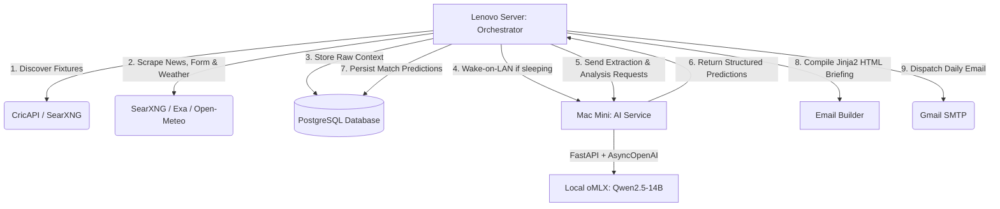

# Match Intel — Cricket Analytics & AI Match Prediction Pipeline

[](https://github.com/sujeethiremath/match_intel/actions/workflows/ci.yml)
[](https://www.python.org/downloads/)
[](https://fastapi.tiangolo.com/)
[](LICENSE)

**Match Intel** is an automated, self-hosted cricket intelligence and match analysis pipeline. It automatically discovers scheduled fixtures, aggregates real-time web context (form, head-to-head records, venue statistics, injury news, weather, pitch conditions, and starting XI lineups), and leverages local Large Language Models (LLMs) via `oMLX` / `Qwen2.5-14B` to perform deep expert match predictions. 

Every morning, Match Intel compiles these predictions into a vintage typewriter-style HTML briefing report and delivers it directly to your email inbox.

---

## 🌟 Key Features

* **Automated Fixture Discovery**: Multi-stage discovery searching CricAPI feeds and self-hosted SearXNG search fallback.
* **Context Enrichment Engine**: Dual-search integration (SearXNG primary, Exa AI fallback) gathering real-time team form, venue records, H2H statistics, and weather data.
* **3-Pass Local AI Analysis**:
  * **Pass 1 (Structured Extraction)**: Structures raw search snippets into clean JSON data schemas.
  * **Pass 2 (Deep Expert Report)**: Executes comprehensive 11-section tactical analysis (ODI & T20 prompts).
  * **Pass 3 (Summary Synthesis)**: Extracts win probabilities, key decider factors, and confidence ratings for email summary cards.
* **Vintage Typewriter HTML Email Briefings**: Custom Jinja2 email compiler rendering responsive briefings with summary comparison cards, tactical breakdowns, and key match deciders.
* **Robust Dual-Node Architecture**: Decoupled design running light pipeline orchestration on one server and local LLM inference on an AI host (with Wake-on-LAN integration).
* **Automated Scheduling**: Granular cron automation for midnight scrapes, 6 AM lineup top-ups, and 8 AM email dispatch.

---

## 🏗️ Architecture Overview

The system operates across a dual-node topology to optimize compute efficiency and separate pipeline orchestration from heavy local LLM inference:


```mermaid
graph TD
    A[Lenovo Server: Orchestrator] -->|1. Discover Fixtures| B(CricAPI / SearXNG)
    A -->|2. Scrape News, Form & Weather| C(SearXNG / Exa / Open-Meteo)
    A -->|3. Store Raw Context| D[(PostgreSQL Database)]
    A -->|4. Wake-on-LAN if sleeping| E[Mac Mini: AI Service]
    A -->|5. Send Extraction & Analysis Requests| E
    E -->|FastAPI + AsyncOpenAI| F[Local oMLX: Qwen2.5-14B]
    E -->|6. Return Structured Predictions| A
    A -->|7. Persist Match Predictions| D
    A -->|8. Compile Jinja2 HTML Briefing| G[Email Builder]
    A -->|9. Dispatch Daily Email| H(Gmail SMTP)
```

For complete technical specifications, see [docs/ARCHITECTURE.md](docs/ARCHITECTURE.md).

---

## 💻 Technology Stack

* **Language**: Python 3.10+
* **AI Service**: FastAPI, AsyncOpenAI SDK, Uvicorn, oMLX local inference engine (`Qwen2.5-14B-Instruct-4bit`)
* **Pipeline & Storage**: PostgreSQL 17, Psycopg2-binary, Loguru, PyYAML, Python-Dotenv
* **Search & Scraping**: SearXNG (Self-hosted), Exa AI Search, CricAPI, Open-Meteo API
* **Email & Templating**: Jinja2 HTML/CSS compiler, Python smtplib (Gmail SMTP)
* **Automation**: Linux cron, `wakeonlan` utility

---

## 📁 Repository Structure

```text
match_intel/
├── mac_mini_service/          # Local FastAPI AI Inference Service
│   ├── main.py                # Service entry point & FastAPI routes
│   ├── models/                # Pydantic schemas (Extract, Analyze, FixtureParser)
│   ├── services/              # LLM extraction & 3-pass match prediction logic
│   ├── prompts/               # System prompt templates (ODI/T20 expert prompts)
│   └── requirements.txt       # Service Python dependencies
│
├── lenovo/                    # Data Scraping & Pipeline Orchestrator
│   ├── pipeline/              # 6-Stage pipeline modules (Stage 1 to 6)
│   │   ├── stage1_fixtures.py # Fixture discovery
│   │   ├── stage2_enrichment.py# Web search & context gathering
│   │   ├── stage3_analysis.py # Mac Mini AI analysis caller
│   │   ├── stage4_topup.py    # Lineup & status updates
│   │   ├── stage5_compile.py  # Jinja2 HTML compilation
│   │   └── stage6_send.py     # Gmail SMTP dispatch
│   ├── scrapers/              # SearXNG, Exa, CricAPI & Weather clients
│   ├── database/              # Schema definition (schema.sql) & queries.py
│   ├── email_builder/         # Jinja2 briefing templates (daily_briefing.html)
│   ├── utils/                 # Logger, timezone, and WoL Mac Mini client
│   ├── config.yaml            # Central configuration file
│   ├── run.sh                 # Pipeline execution script
│   └── requirements.txt       # Pipeline Python dependencies
│
├── docs/                      # Documentation
│   ├── ARCHITECTURE.md        # System architecture & data flow
│   ├── DEVELOPMENT.md         # Developer guide & local setup
│   ├── CONFIGURATION.md       # Configuration & environment variables
│   └── API.md                 # AI Service API documentation
│
├── .github/                   # GitHub Actions CI & Issue/PR templates
├── .env.example               # Environment variables example template
├── requirements.txt           # Unified dependency manifest
└── README.md                  # Project README
```

---

## 🚀 Quick Start & Installation

### Prerequisites

* **Python 3.10+**
* **PostgreSQL 14+** (PostgreSQL 17 recommended)
* **SearXNG** (or an Exa API key)
* **Local oMLX / LLM Server** (running `Qwen2.5-14B-Instruct-4bit` on port `8000`)

---

### Step 1: Environment Configuration

Clone the repository and prepare environment files:

```bash
git clone https://github.com/sujeethiremath/match_intel.git
cd match_intel

# Copy example environment configuration
cp .env.example lenovo/.env
```

Edit `lenovo/.env` with your credentials:

```ini
GMAIL_APP_PASSWORD=your_gmail_app_password
DB_PASSWORD=your_postgres_password
CRICAPI_KEY=your_cricapi_key
EXA_API_KEY=your_exa_api_key
MAC_MINI_HOST=localhost
MAC_MINI_PORT=8001
MAC_MINI_MAC_ADDRESS=00:11:22:33:44:55
SEARXNG_URL=http://localhost:8080
EMAIL_RECIPIENT=recipient@example.com
EMAIL_SENDER=sender@example.com
```

---

### Step 2: Initialize Database

Set up the PostgreSQL database schema:

```bash
createdb match_intel
psql -d match_intel -f lenovo/database/schema.sql
```

---

### Step 3: Launch AI Inference Service (Mac Mini Host)

```bash
cd mac_mini_service
python3 -m venv venv
source venv/bin/activate
pip install -r requirements.txt

# Start FastAPI server on port 8001
uvicorn main:app --host 0.0.0.0 --port 8001
```

---

### Step 4: Run the Pipeline Orchestrator (Lenovo Server)

```bash
cd lenovo
python3 -m venv venv
source venv/bin/activate
pip install -r requirements.txt

# Run full pipeline (Stage 1 -> Stage 2 -> Stage 3)
./run.sh pipeline

# Alternatively, trigger individual stages:
./run.sh topup   # Stage 4: Lineups top-up
./run.sh email   # Stage 5 & 6: Compile & Send Briefing
```

---

## ⏰ Automated Cron Schedule

To deliver daily briefing reports automatically, add the following cron entries on your orchestrator server:

```cron
# 12:00 AM — Stage 1, 2 & 3: Fixture Discovery, Context Enrichment & AI Analysis
0 0 * * * cd /path/to/match_intel/lenovo && ./run.sh pipeline >> logs/midnight.log 2>&1

# 06:00 AM — Stage 4: Lineups and Status Top-up
0 6 * * * cd /path/to/match_intel/lenovo && ./run.sh topup >> logs/topup.log 2>&1

# 08:00 AM — Stage 5 & 6: Compile HTML & Send Briefing Email
0 8 * * * cd /path/to/match_intel/lenovo && ./run.sh email >> logs/email.log 2>&1
```

---

## 📚 Documentation

For in-depth guides, review the dedicated documentation in `docs/`:

* 🏛️ **[Architecture & Data Flow](docs/ARCHITECTURE.md)**
* 💻 **[Development & Setup Guide](docs/DEVELOPMENT.md)**
* ⚙️ **[Configuration & Environment Variables](docs/CONFIGURATION.md)**
* 🔌 **[AI Service API Specification](docs/API.md)**

---

## 🛡️ Security & Privacy

* **Secrets Management**: No hardcoded API keys or passwords exist in the codebase. All credentials are isolated in local `.env` files which are excluded from Git via `.gitignore`.
* **Private Infrastructure**: Server IPs, MAC addresses, and personal email addresses are sanitized to configurable environment variables and generic defaults.

---

## 🤝 Contributing

Contributions are welcome! Please feel free to open issues or submit pull requests. Before submitting a PR, ensure that:

1. Code compiles without errors (`python3 -m py_compile ...`).
2. No real credentials or personal information are committed.
3. Tests and documentation are updated.

See [docs/DEVELOPMENT.md](docs/DEVELOPMENT.md) for detailed guidelines.

---

## 📄 License

This project is licensed under the [MIT License](LICENSE) — see the LICENSE file for details.

---

## ⚠️ Disclaimer

Match Intel match predictions and win probabilities are generated by Large Language Models for analytical and educational purposes only. They do not constitute financial or sports betting advice.
