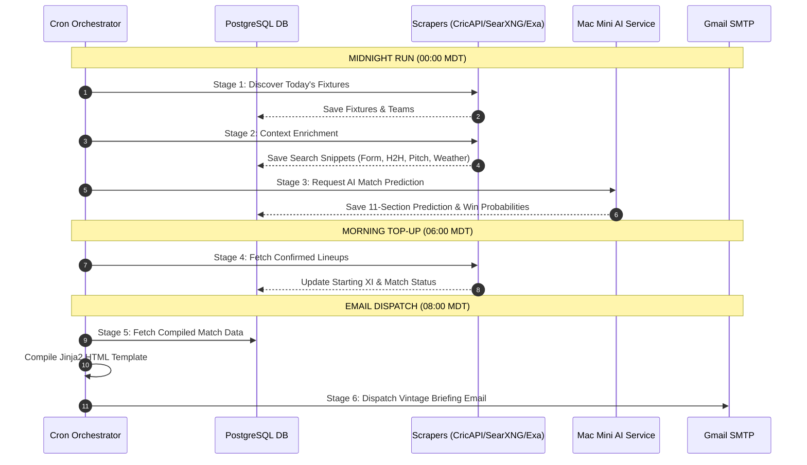
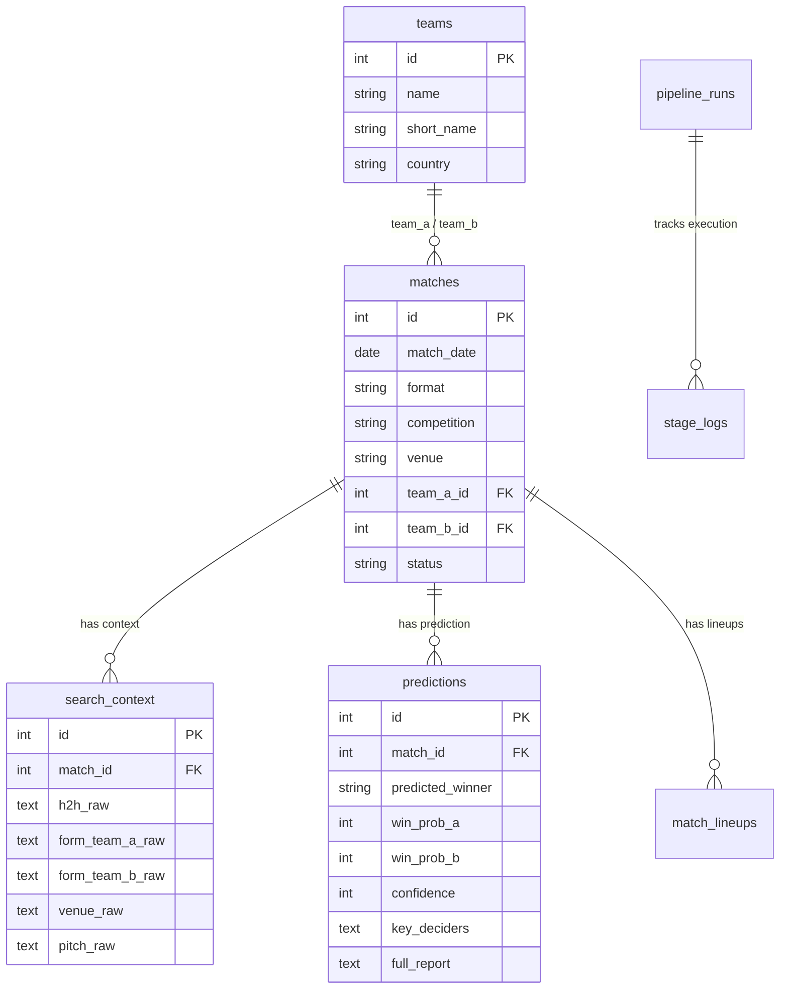

# Match Intel — Architecture & Technical Specifications

This document details the system architecture, dual-node infrastructure, component interactions, database schema, data flow, and pipeline stages of **Match Intel**.

---

## 1. System Overview

Match Intel is designed around a **decoupled, event-driven dual-node architecture**:

1. **Pipeline Orchestrator Node (Lenovo Server)**: Handles data feed scraping, web search enrichment, PostgreSQL persistence, cron orchestration, Jinja2 HTML email compilation, and SMTP delivery.
2. **AI Inference Host Node (Mac Mini M4)**: Dedicated AI service running FastAPI and `oMLX` (`Qwen2.5-14B-Instruct-4bit`). Executes structured JSON extractions and deep multi-pass cricket match predictions.

---

## 2. End-to-End Pipeline Lifecycle

The automated workflow consists of **6 sequential stages**:

---

## 3. Pipeline Stages Breakdown

### Stage 1: Fixture Discovery (`stage1_fixtures.py`)
- Discovers scheduled international (ODI, T20I) and major league (e.g. MLC) matches for the target date.
- Primary source: CricAPI fixture feed (`cricapi_client.py`).
- Fallback: SearXNG query parsing (`searxng_client.py` + Mac Mini `/parse-fixtures` endpoint).
- Matches are normalized into `matches` and `teams` tables in PostgreSQL.

### Stage 2: Context Enrichment (`stage2_enrichment.py`)
- For each scheduled match, executes targeted search queries:
  - Head-to-Head (H2H) records
  - Recent team form (last 10 matches)
  - Venue stats & average innings scores
  - Injury news & player availability
  - Pitch report & weather conditions (via Open-Meteo API)
- Dual-search strategy: Queries self-hosted SearXNG first; if snippets are insufficient, falls back to Exa AI Search.

### Stage 3: AI Match Analysis (`stage3_analysis.py`)
- Wakes the Mac Mini host if asleep using Wake-on-LAN magic packets (`wake_mac_mini.py`).
- Calls Mac Mini `/extract` to parse raw search snippets into clean JSON.
- Calls Mac Mini `/analyze` to run the 3-pass LLM prediction workflow:
  - **Pass 1**: Produces full 11-section expert analysis report (ODI or T20 system prompt).
  - **Pass 2**: Extracts structured summary card fields (predicted winner, reasoning, win probabilities, key deciders, confidence score).
  - **Pass 3**: Persists prediction metrics to `predictions` table in PostgreSQL.

### Stage 4: Lineup & Status Top-up (`stage4_topup.py`)
- Runs at 06:00 MDT to check for starting XI announcements and status changes.
- Updates playing XI details in the database before briefing compilation.

### Stage 5: Briefing HTML Compilation (`stage5_compile.py`)
- Retrieves match data, team form, venue records, and AI predictions from PostgreSQL.
- Renders the responsive Jinja2 HTML template (`email_builder/templates/daily_briefing.html`).
- Saves a local fallback copy to `logs/latest_briefing.html`.

### Stage 6: SMTP Email Dispatch (`stage6_send.py`)
- Connects to Gmail SMTP (`smtp.gmail.com:587` with STARTTLS).
- Authenticates using `GMAIL_APP_PASSWORD`.
- Delivers the briefing report to `EMAIL_RECIPIENT`.
- Records delivery status in `email_log` database table.

---

## 4. Database Schema Overview

Match Intel uses a relational PostgreSQL database schema defined in `lenovo/database/schema.sql`:

---

## 5. Security & Privacy Architecture

- **No Public Credentials**: All sensitive endpoints, database connection strings, and API keys are specified strictly via environment variables (`.env`).
- **Network Isolation**: The AI service (`mac_mini_service`) runs locally and communicates with the orchestrator (`lenovo`) via secure internal network calls or localhost.
- **Fail-Safe Logging**: Local file logging in `logs/` ensures report retention even during network or SMTP outages.
